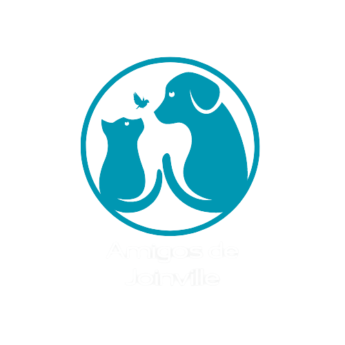

# Projeto Integrador - Documentação

Um modelo para o desenvolvimento do Projeto Integrador do Curso de Técnico em Desenvolvimento de Sistemas para a Internet Integrado ao Ensino Médio do IFC - Campus Araquari.

Alunos: [Ana Paula de Souza](https://github.com/aanappaula) e [Ana Luiza Dias da Rocha](https://github.com/AnaLuizaDias) - 3info1

Professores: [Marco André Mendes](github.com/marcoandre) e [Alann Perini](https://github.com/AlannKPerini).

Links do projeto:

-   [Documentação (esse documento)](github.com/aanappaula/projeto_integrador)
-   [Backend](github.com/marcoandre/pi-backend)
-   [Frontend](github.com/marcoandre/pi-frontend)

# Modelos de Sistemas

**A base do nosso projeto foi inspirada no modelo de vendas de padaria.**

#  Introdução

<h2>Amigos de Joinville</h2>

**Adoção de animais abandonados e perdidos em Joinville e região.**

Paula e Luiza são duas amigas que sempre amaram os animais. Resgatando um gato ou um cachorro de vez em quando, elas decidiram realizar um sonho antigo. Em 2021, elas inauguraram uma ONG para adoção de animais em Joinville e região, para ajudar os animais que foram abandonados ou estão perdidos a acharem um lar. A ONG “Amigos de Joinville”, é divulgada somente em suas redes sociais (Instagram e Facebook). Com a grande repercussão da ONG, foi vista uma necessidade da criação de um site, para ter o melhor controle dos animais, das adoções, e fazer a avaliação dos tutores para  assim realizar a possível adoção.

# Situação Problema

**Descrição dos problemas que envolvem a empresa num todo**
<h2>Problemas:</h2>
Divulgação - Geralmente muitos animais ficam abandonados por muito tempo nas ruas. Ou ainda são abandonados pelos próprios tutores. Se tiver uma boa divulgação desses animais, a procura de lar para eles ficará mais fácil, já que estará na internet.

Documentação para a adoção -  Um grande problema que ocorre nas adoções, é referente aos tutores, que muitas vezes não responsáveis. Para a adoção ser segura, deverá ser cobrado toda a documentação da pessoa interessada a adotar. Logo depois, o site deverá retornar a aprovação ou negação da adoção.

Localização 

# Conclusão

Diante dos problemas deferidos acima, o nosso site deverá inserir de forma rápida logo assim que cada novo animal perdido for encontrado, assim será as chances do animal achar um lar são mais altas. 
O site deverá cobrar toda uma documentação quando o usuário do site solicitar uma adoção. Após o usuário enviar toda a documentação, o sistema deverá analisar o pedido, e deferir a aprovação ou negar a adoção.

**Achar soluções para os problemas ditados acima.**

