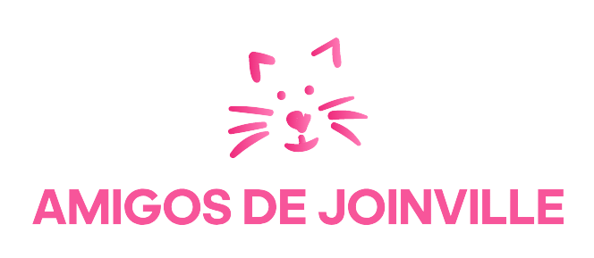

# Projeto Integrador - Documentação

Um modelo para o desenvolvimento do Projeto Integrador do Curso de Técnico em Desenvolvimento de Sistemas para a Internet Integrado ao Ensino Médio do IFC - Campus Araquari.

Alunos: [Ana Paula de Souza](https://github.com/aanappaula) e [Ana Luiza Dias da Rocha](https://github.com/AnaLuizaDias) - 3info1

Professores: [Marco André Mendes](github.com/marcoandre) e [Alann Perini](https://github.com/AlannKPerini).

Links do projeto:

-   [Documentação (esse documento)](github.com/aanappaula/projeto_integrador)
-   [Backend](github.com/marcoandre/pi-backend)
-   [Frontend](github.com/marcoandre/pi-frontend)

# Modelos de Sistemas

A base do nosso projeto foi inspirada no modelo ponto de vendas (PDV). Desde o início queríamos fazer o site referente a adoções de animais, visto que temos bastante familiarização do assunto, já que em anos anteriores tivemos a chance de trabalhar com esse modelo de site. E o modelo que mais se encaixa nesse quesito de realizar uma "compra" do animal, é o (PVD).

#  Introdução

<h2>Amigos de Joinville</h2>

Paula e Luiza são duas amigas que sempre amaram os animais. Resgatando um gato ou um cachorro de vez em quando, elas decidiram realizar um sonho antigo. Em 2021, elas inauguraram uma ONG para adoção de animais em Joinville e região, para ajudar os animais que foram abandonados ou estão perdidos a acharem um lar. A ONG “Amigos de Joinville”, é divulgada somente em suas redes sociais (Instagram e Facebook). Com a grande repercussão da ONG, foi vista uma necessidade da criação de um site, para ter o melhor controle dos animais, das adoções, e fazer a avaliação dos tutores para  assim realizar a possível adoção.

# Situação Problema

<h2>Problemas:</h2>

**A chegada do animal:** 
Vemos por aí, principalmente nas ruas, muitos cachorros e gatos abandonados. O problema então seria como que esses animais chegariam até a ONG. Caso alguma das donas avistassem esses animais, rapidamente eles seriam levados até a ONG. Já se outra pessoa avistasse e queira ajudar, ela deverá comunicar a ONG, e assim que possível ela ou a ONG fariam o resgate. 

**Divulgação:** 
A falta de divulgação de animais em um sistema de adoção é um problema que pode dificultar a adoção de animais, pois muitas vezes as pessoas não sabem que existem animais disponíveis para adoção. Portanto, é fundamental a divulgação em midias sociais (como Instagram, Facebook, Twitter e TikTok). também vale ressaltar a importância de manter as informações sobre os animais disponíveis para adoção atualizadas regularmente, e que os adotantes em potencial tenham acesso a fotos e descrições detalhadas dos animais.

**Falta de recursos e infraestrutura:** 
Uma das grandes dificuldades em um sistema de adoção de animais, é mantê-los sob os cuidados necessários para atender às suas necessidades básicas (como água, alimentos, castração, atendimento veterinário e  infraestrutura adequada) até o momento da adoção. Para isso, é importante estabelecer parcerias com organizações e veterinários locais para garantir o bem-estar dos animais e melhorar a qualidade dos cuidados prestados.

**Documentação:** 

A falta de monitoramento e fiscalização pode permitir que animais sejam adotados por pessoas que não têm condições de cuidar deles adequadamente. Para isso, é importante exigir documentação necessária, realizar entrevistas com os adotantes e verificar suas condições de vida e experiência com animais.

**Falta de transparência no processo de adoção:**

Muitas vezes, os adotantes não recebem informações suficientes sobre o animal, como histórico médico, comportamental e de alimentação, o que pode levar a problemas após a adoção. Para isso, é necessário fornecer informações detalhadas sobre o animal para o melhor conhecimento do adotante.

# Conclusão

Diante dos problemas deferidos acima, o site deverá atualizar rapidamente a medida que o animais abandonados forem resgatados. No caso de animais perdidos, o sistema deverá manter o animal durante 15 dias no sistema, mas se nesse perído o dono não for encontrado, o animal ficará disponível para adoção.
O site deverá cobrar toda uma documentação quando o usuário do site solicitar uma adoção. Após o usuário enviar toda a documentação, o sistema deverá analisar o pedido, e deferir a aprovação ou negar a adoção.

#  Descrição da proposta

-   **Qual o foco de ação do software**: 
O foco do software é promover e divulgar a adoção de animias perdidos ou abandonados na rua.
-   **Os níveis de usuário do sistema**: 
As donas da ONG juntamente com funcinários selecionados terão acesso ao sistema de forma administradora. Já os usuários do site terão algumas funcionalides restritas (não poderão atualizar a saída e chegada de novois animais).
-   **O que poderá ser feito no software**: 
O usuário poderá acessar o site fazendo ou não o login, e caso não tenha poderá se cadastrar. Então poderá visualizar as páginas disponivéis: a home, dos animais cadastrados, das informações da ONG, das minhas informações (conta), e da estática de animais adotados por mês. Caso o usuário se interesse por algum animal, ele deverá enivar toda a documentação necessária que o site requere. Se aprovado, o usuário poderá agendar a retirada do animal na ONG. Se reprovado, deverá esperar 1 dia para poder enviar a documentação novamente. 

#  Regras de Negócio
-   **RN001**: 
 Para registro de adotantes deverá estabelecer critérios claros de elegibilidade para adotantes de animais, tais como idade mínima, disponibilidade de tempo para cuidar do animal, espaço adequado para acomodar o animal, entre outros.
-   **RN002**: 
 Para realizar um processo claro e transparente de adoção, deve-se incluir um formulário de inscrição, entrevista e avaliação do candidato, e verificação de referências.
-   **RN003**: 
 No processo de adoção deverá estabelecer-se uma taxa de adoção para ajudar a cobrir os custos associados à adoção, como cuidados veterinários, alimentação e suprimentos.
-   **RN004**: 
 Deve ser realizado um acompanhamento pós-adoção para garantir que o animal esteja sendo bem cuidado e para oferecer suporte adicional, se necessário.
-   **RN004**: 
 Em caso de devolução dos animais, a política de devolução deverá ser clara, quando em problemas de saúde ou comportamentais, ou de mudanças nas circunstâncias do adotante que impeçam a manutenção do animal.
-   **RN006**: 
 Para registro de animais para doação deve-se fornecer informações claras e precisas sobre os animais disponíveis para adoção, incluindo idade, histórico de saúde, comportamento e necessidades especiais, sendo transparente em relação às suas políticas e procedimentos.

# Requisitos Funcionais 
<h2>Entradas:</h2>

- **RF001** 
 Registro de animais disponíveis para adoção: O sistema deve permitir o registro de dados sobre animais disponíveis para adoção. Dados necessários: tipo de animal (cão, gato, etc.), raça, idade, sexo, cor, tamanho, histórico médico e comportamental.
- **RF002** 
 Informações do adotante: O sistema deve permitir o registro de informações sobre o adotante. Dados necessários: nome, endereço, telefone, e-mail, idade, histórico de adoção de animais, preferências de animal, disponibilidade de espaço em casa e outras informações relevantes.
- **RF003** 
 Requisitos do adotante: O sistema deve permitir que os adotantes informem suas preferências de animal. Dados necessários: tipo de animal desejado, tamanho, idade, temperamento e outras informações relevantes.
- **RF004** 
 Agendamento de visitas: O sistema deve permitir que os adotantes agendem visitas para conhecer os animais em um determinado horário, e que o abrigo ou centro de adoção possa agendar visitas correspondentes. Dados necessários: data e horário da visita agendada.

<h2>Processos:</h2>

- **RF006** 
 Triagem do adotante: O sistema deve permitir que o abrigo realize uma triagem do adotante, incluindo um questionário de adoção e uma entrevista, para garantir que ele esteja apto a adotar um animal e possua a capacidade de cuidar adequadamente do animal. Dados necessários: Horário de trabalho; Declaração de renda; Comprovante de residência.
- **RF007** 
 Avaliação do ambiente doméstico: O sistema deve permitir que o abrigo avalie o ambiente doméstico do adotante para garantir que é um ambiente seguro e adequado para o animal. Dados necessários: Características da moradia.
- **RF008** 
 Adoção: O sistema deve permitir que o abrigo realize o processo de adoção, incluindo o preenchimento de documentos e o pagamento de taxas de adoção.
- **RF009** 
 Registro de dados: O sistema deve permitir que os dados do animal e do adotante sejam registrados e armazenados no sistema.

<h2>Saídas:</h2>

- **RF010** 
 Documento de adoção: O sistema deve gerar um documento de adoção para o adotante. Dados necessários: nome do animal, data de adoção, taxa de adoção.
- **RF011** 
 Registro de adoção: O sistema deve atualizar o registro do animal como adotado e retirá-lo da lista de animais disponíveis para adoção. Dados necessários: 
- **RF012** 
 Informações do animal adotado: O sistema deve fornecer informações detalhadas sobre o animal adotado. Dados necessários: histórico médico, informações de vacinação, instruções sobre cuidados e treinamento, bem como quaisquer outros detalhes relevantes sobre o animal.
- **RF013** 
 Informações de contato do adotante: O sistema deve armazenar informações de contato do adotante para futuras atualizações e verificações de bem-estar do animal adotado. Dados necessários:

# Requisitos Não Funcionais 

- **RFN1** 
 Segurança: O sistema deve ser seguro e proteger as informações pessoais dos usuários e dos animais cadastrados. O acesso ao sistema deve ser restrito a usuários autorizados e as informações devem ser armazenadas de forma segura.

- **RFN2** 
 Escalabilidade: O sistema deve ser capaz de lidar com um grande número de usuários e animais cadastrados. O sistema deve ser projetado de forma escalável para garantir que possa crescer e se adaptar ao aumento do tráfego.

- **RFN3** 
 Performance: O sistema deve ser rápido e responsivo, permitindo que os usuários acessem e atualizem as informações com rapidez e eficiência.

- **RFN4** 
Disponibilidade: O sistema deve estar disponível e funcionando o tempo todo, com um tempo de inatividade mínimo para garantir que os usuários possam acessá-lo sempre que necessário.

- **RFN5** 
regulamentações aplicáveis, como a proteção de dados pessoais e os regulamentos de adoção de animais.

- **RFN6** 
Banco de Dados: O sistema será implementado com MySQL.

- **RFN7** 
 Framework: Os frameworks utilizados para o desenvolvimento do sistema serão VueJS e React Native.

- **RFN8** 
 Linguagens: O sistema deverá ser desenvolvido com as linguagens JavaScript, HTML5, e CSS3.
